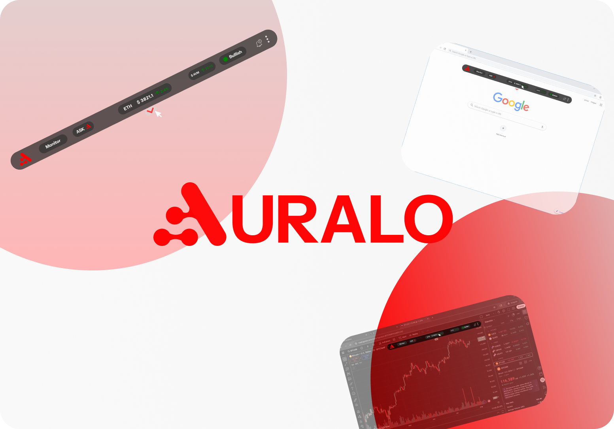

# Overview

Auralo is designed for the Web3 era as a real-time market intelligence platform powered by AI. Auralo appears as a persistent overlay for browsers or desktop environments which brings relevant information to traders, DeFi users, and researchers in real-time. It integrates analytics and off-chain data, off-chain market data, and sentiment evaluation to give AI-driven insights in a single window as per the user's flow.

Today's market scramble is a source of pain for the users. Auralo helps by providing information intelligence in a simplified view, which allows users to make decisions quickly and track numerous things without worrying about information overload and lost opportunities. It replaces the need of constant making or losing essential tabs.

As data aggregator, Auralo provides the higher level of service by providing real-time analytics along with contextual relevance to the users. This additional AI layer helps users grasp the importance of actions and anticipate the impending consequences linked with it.

Auralo enables a simple actionable goal which is to increase user's confidence while making decisions in highly fluctuating markets. The combination of features ensures traders do no face issues tracking opportunities. Users simply make upload, process, and download operations while Auralo takes care of everything.

<figure><figcaption></figcaption></figure>
