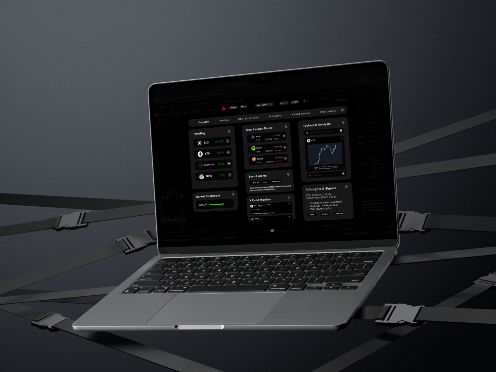

# Core Product

<figure><figcaption></figcaption></figure>

Auralo serves as a high-performance, always-on layer for market intelligence that consolidates critical information streams into a singular, customizable interface. Its architecture as well as its features are built around intelligence, speed, and adaptability.

#### Intelligence

Traders’ tools and trading systems have always acted as passive dashboards, displaying numbers, graphs, and feeds. Auralo changes this dynamic by integrating AI that works perpetually in the background. These models analyze:

* **Price action** for the identification of patterns, breakouts and reversals.&#x20;
* **Sentiment shifts** on social and community channels for the emergence of narratives long before they are visible in price.
* **Sentiment trends** across social and community channels to identify narrative shifts before they fully materialize in price.
* **Liquidity shifts** that expose latent accumulation or distribution and sudden risks.
* **On-chain activity** for the tracking of wallets, contract deployments, and token events.

To prevent information overload, Auralo uses a proprietary AI-based extraction, filtering, and prioritizing information based on relevance, urgency, and potential impact. Every insight comes with relevant contextual information so a trader using Auralo would not only see what is happening, but would understand the underlying rationale and how it would impact his or her strategy.

#### Speed

In Web3 markets, the opportunities are fleeting, and strategic trades need to be executed within seconds. Auralo's systems minimize event detection to delivery processing within the framework of low-latency architecture. The system detects and surfaces events such as the following:

* Balance changes and interactions of whale wallets which are likely to trigger substantial future movements.
* Fast-paced sentiment shifts due to news, statements, or events by key opinion leaders (influencers).
* Movement of assets indicating either a market maker's or a capital investor's liquidity shift.

These event insights are generated within a few seconds, ensuring critical time windows are not wasted. The speed advantage is not only in data collection but also in information contextualization.

#### Adaptability

Every user within a definable community of traders is likely to have different styles and workflows. Some traders are more likely to combine different strategies while others are on-chain signal dependent or technical signal dependent. Auralo resolves these issues by permitting flexibility and full user-defined interface. Traders are enabled to control:

* Arrangements of streams and widgets to match workflows (layouts).
* Visual themes for clarity and comfort, especially during extended trading hours.
* Metrics and insights relevancy, as only the most relevant are configurable in the widgets.

Apart from customization, Auralo has a plugin ecosystem that supports external developers to enhance its functionalities. This permits addition of more exchanges, research AI models, specialized analytics modules, or even custom tools developed for private trading groups.

Seamless Integration

Traders are allowed to keep their current tools since Auralo integrates with centralized exchanges and decentralized exchanges, analytics tools, and on-chain data providers. Auralo integrates with existing workflows, eliminating the need for constant platform switching, and flawlessly aligning with the trader’s ecosystem.

Auralo transforms into proactively anticipatory tools and goes beyond functionalities of mere dashboards by integrating algorithms, high-frequency execution, and market adaptability for users to optimize their strategies. Auralo smart anticipatory mechanisms streamlines processes by eliminating irrelevant information and noise and provides information that is contextually needed at the precise moment.
